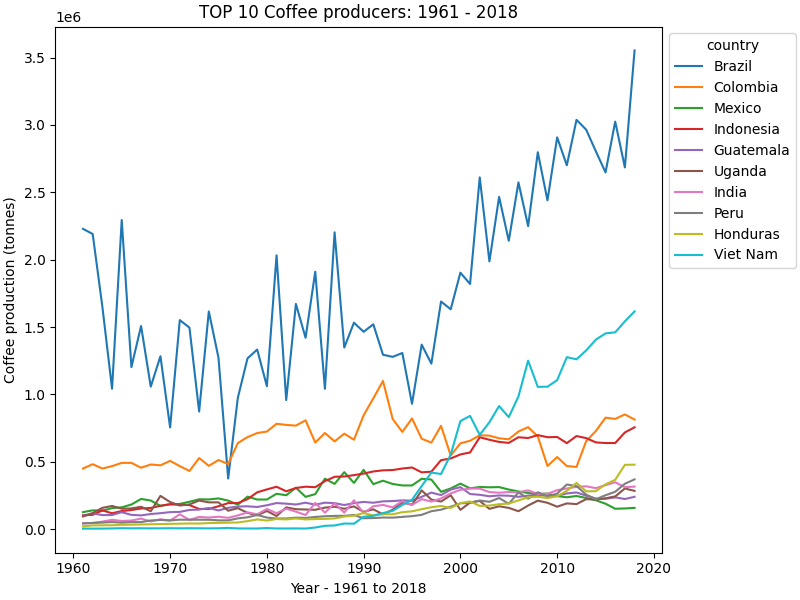
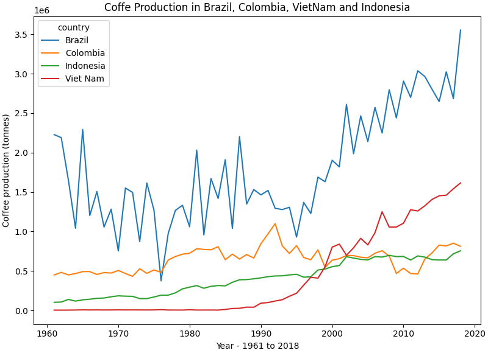

# Exploratory data analysis within coffee and rural population.

## DATA 
All data was collected on the Food and Agriculture Organization of the United Nations (FAO) website.

### Coffe production (tonnes) by country and region: 

dataset: Crops and livestock products
Crop and livestock statistics are recorded for 278 products. Last Updated February 17, 2022
https://www.fao.org/faostat/en/?#data/QCL

### Annual population (rural population included)

The FAOSTAT Population module contains time series data on population, by sex and urban/rural. The series consist of both estimates and projections for different periods as available from the original sources, namely: 1. Population data refers to the World Population Prospects: The 2019 Revision from the UN Population Division.2. Urban/rural population data refers to the World Urbanization Prospects: The 2018 Revision from the UN Population Division. Last updated in December 3, 2021
https://www.fao.org/faostat/en/?#data/OA

### Data viz...
https://public.tableau.com/views/Coffe_EDA_viz/Largestcoffeeproducers_1?:language=pt-BR&:display_count=n&:origin=viz_share_link

## OKR

Objective: Investigate possible relation betweeen coffee production, rural population and trades.

**KR1. Who are the largest coffee producers ever?**

top20
['Brazil', 'Colombia', 'Viet Nam', 'Indonesia', 'Mexico', 'Guatemala', 'India', 'Uganda', 'Peru', 'Honduras', 'Ethiopia', 'El Salvador', 'Costa Rica', 'Ethiopia PDR', 'Philippines', 'Cameroon', 'Ecuador', 'Madagascar', 'Kenya', 'Congo DR']
top10
['Brazil', 'Colombia', 'Viet Nam', 'Indonesia', 'Mexico', 'Guatemala', 'India', 'Uganda', 'Peru', 'Honduras']

**KR2. How did the coffee production oscilates during the years 1961 to 2018?**

Attention is drawn to the oscilation in production for Brazil, Colombia, VietNam and Indonesia. See below:

### 

** Sorting coffee production of Brazil, Colombia, VietNam and Indonesia over time **

** KR3. How did the population of Brazil, Colombia, VietNam and Indonesia changed over time? **

** KR5. What was the proportion of rural population in Brazil, Colombia, VietNam and Indonesia over time? **

